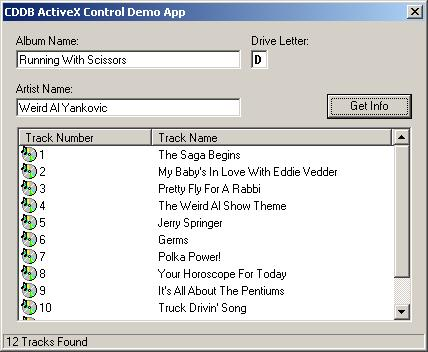



## CDDB Control \+ Demo & Source

### Description

This is a remake of my 1st control (http://www.planet-source-code.com/vb/scripts/ShowCode.asp?lngWId=1&txtCodeId=3553), all bugs have been fixed!
 
### More Info
 
To Install: Run the 'Reg Control.bat'

To Uninstall: Run the 'UnReg Control.bat'

             |
---                |---
**Submitted On**   |2000-06-25 16:22:02
**By**             |[Michael L\. Barker](https://github.com/Planet-Source-Code/PSCIndex/blob/master/ByAuthor/michael-l-barker.md)
**Level**          |Intermediate
**User Rating**    |4.3 (30 globes from 7 users)
**Compatibility**  |VB 3\.0, VB 4\.0 \(16\-bit\), VB 4\.0 \(32\-bit\), VB 5\.0, VB 6\.0, VB Script, ASP \(Active Server Pages\) 
**Category**       |[OLE/ COM/ DCOM/ Active\-X](https://github.com/Planet-Source-Code/PSCIndex/blob/master/ByCategory/ole-com-dcom-active-x__1-29.md)
**World**          |[Visual Basic](https://github.com/Planet-Source-Code/PSCIndex/blob/master/ByWorld/visual-basic.md)
**Archive File**   |[CODE\_UPLOAD71576252000\.zip](https://github.com/Planet-Source-Code/michael-l-barker-cddb-control-demo-source__1-9261/archive/master.zip)

